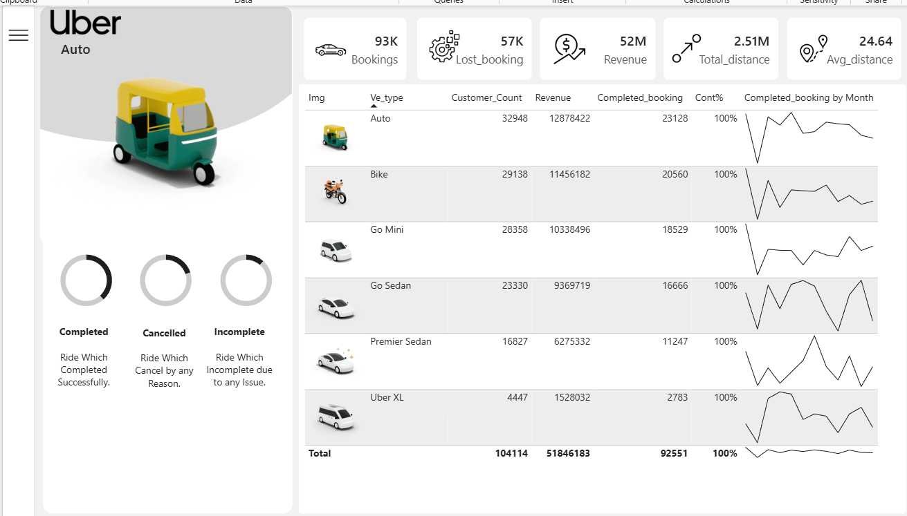
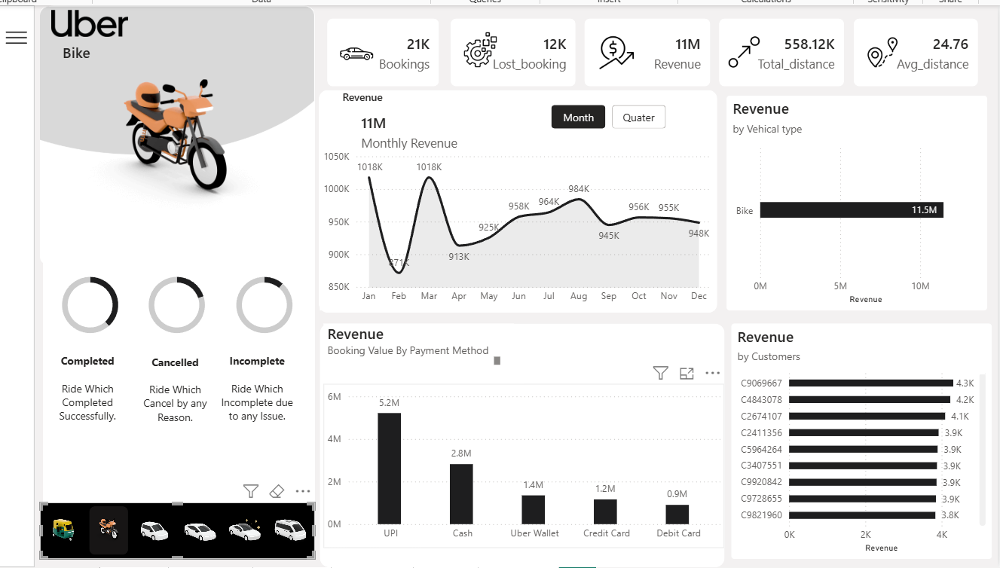

# 🚖 Uber Ride Analytic Dashboard

## 📌 Project Overview

The Uber Ride Analytic Dashboard is an interactive Power BI project developed to analyze ride booking operations, customer behavior, revenue generation, and vehicle performance across different Uber service categories. This dashboard transforms raw operational data into meaningful business insights using interactive visualizations, KPI tracking, and dynamic filters.

The project helps stakeholders monitor booking trends, evaluate service performance, identify customer preferences, and make data-driven business decisions to improve operational efficiency and customer satisfaction.

---

## 🎯 Business Objective

The primary objective of this dashboard is to:

- Monitor ride booking performance.
- Analyze revenue across different vehicle categories.
- Evaluate booking completion and cancellation rates.
- Understand customer behavior and ride patterns.
- Compare vehicle-wise operational performance.
- Support business decision-making through interactive dashboards.

---

# 📊 Dashboard Preview

## Overall Dashboard

.png)

---

## Auto Analysis

---

## Auto Vehicle Dashboard

---

## Bike Dashboard

---

## Go Mini Dashboard

---

## Premier Sedan Dashboard

---

# 📈 Key Performance Indicators (KPIs)

- 🚖 Total Bookings
- 💰 Total Revenue
- 📍 Total Distance Travelled
- 📊 Average Booking Value
- ⭐ Customer Rating
- ⭐ Driver Rating
- ❌ Cancelled Bookings
- ✅ Completed Bookings
- ⏳ Incomplete Bookings

---

# 🔍 Business Insights

### Revenue Analysis
- Compared revenue generated across different Uber vehicle categories.
- Identified the highest revenue-generating ride types.

### Customer Behaviour
- Analyzed booking trends and customer preferences.
- Identified repeat and first-time customer patterns.

### Operational Performance
- Monitored completed, cancelled, and incomplete rides.
- Evaluated booking success rate and operational efficiency.

### Payment Analysis
- Compared payment methods including UPI, Cash, Credit Card, Debit Card, and Wallet transactions.

### Vehicle Performance
- Compared Auto, Bike, Go Mini, Premier Sedan, Uber XL, and other ride categories.
- Identified the most utilized vehicle category.

### Location Analysis
- Identified top pickup and drop locations.
- Analyzed demand across different regions.

---

# ✨ Dashboard Features

✔ Interactive Navigation

✔ Dynamic KPI Cards

✔ Vehicle-wise Analysis

✔ Revenue Dashboard

✔ Booking Trend Analysis

✔ Customer Insights

✔ Driver Performance Monitoring

✔ Payment Mode Analysis

✔ Interactive Filters

✔ Business Intelligence Reporting

---

# 🛠️ Tools & Technologies

- Power BI
- Microsoft Excel
- DAX
- Power Query
- Data Modeling
- Business Intelligence
- Data Visualization

---

# 💡 Skills Demonstrated

- Data Analysis
- Dashboard Development
- Business Intelligence
- KPI Reporting
- DAX
- Data Modeling
- Data Cleaning
- Data Visualization
- Decision Support Analytics

---

# 📂 Repository Contents

| File | Description |
|------|-------------|
| uber_dashboard.pbix | Power BI Dashboard |
| Overall Dashboard (1).png | Dashboard Overview |
| Auto Analysis.png | Auto Category Analysis |
| Auto.png | Auto Dashboard |
| Bike.png | Bike Dashboard |
| Go mini.png | Go Mini Dashboard |
| Premier sadan.png | Premier Sedan Dashboard |

---

# 🚀 Project Impact

This dashboard enables businesses to monitor ride operations, analyze customer trends, improve service quality, optimize revenue, and support strategic decision-making through interactive Power BI visualizations.

---

## 👨‍💻 Author

**Pranav Kedar**

**Aspiring Data Analyst**

**Skills:** SQL • Power BI • Excel • Python • Data Visualization • DAX • Business Intelligence
